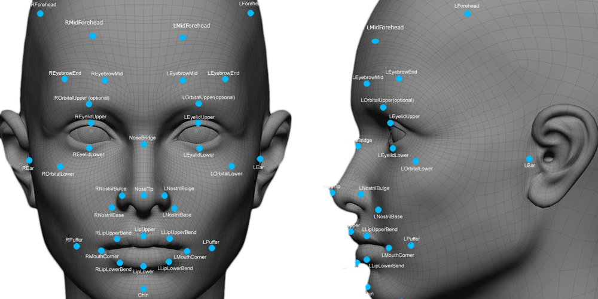

<!-- Read.me default para meus projetos -->

[//]: # (Title: Reconhecimento Facial em imagens com openCV)
[//]: # (Author:  Jonas Campos)
[//]: # (Date: April 1, 2011)
[//]: # (Comment: Explicações rápidas sobre o reconhecimento de imagens e a aplicação do openCV para reconhecer rostos em imagens) 
[//]: # (Tags: #opencv, #computervision, #python)  

<!-- PROJECT SHIELDS |  -->
<p align='center'>
  <!-- Python -->
  

  <!-- Jupyter -->
  
</p>



<!-- PROJECT LOGO -->
<h3 align="center">Reconhecimento Facial em imagens com openCV</h3>

<p align="center">Explicações rápidas sobre o reconhecimento de imagens e a aplicação do openCV para reconhecer rostos em imagens</p>

<p align="center">

</p>

<!-- ABOUT THE PROJECT -->
## About The Project

O rosto humano, apesar das variações de pessoa para pessoa, possui uma composição básica que não se altera, lida pelos aplicativos como pontos em comum, que variam de acordo com a complexidade do sistema.

Para reconhecer as imagens, usarei a Open Source Computer Vision Library (OpenCV), que é uma biblioteca com mais de 2500 algoritmos de visão computacional e aprendizado de máquina. Possui uma comunidade estimada em mais de 47 mil usuários colaboradores, e o download da biblioteca passa os 18 milhões (OpenCV, 2021).

<!-- GETTING STARTED -->
## Getting Started

To get a local copy up and running follow these simple steps.

### Installation

1. Clone the repo
   ```sh
   git clone gh repo clone jonasaacampos/Reconhecimento-Facial-em-imagens-com-openCV
   ```
2. Install openCV packages
   ```sh
   !pip install opencv-contrib-python
   ```


<!-- Exemplos -->
## Exemplos


_For more examples, please refer to the [Arquivo completo](Reconhecimento%20Facial%20em%20imagens%20com%20openCV.ipynb)_

<!-- LICENSE -->
## Licença de utilização

<a rel="license" href="http://creativecommons.org/licenses/by/4.0/">
  
</a>
<br/>
This work is licensed under a <a rel="license" href="http://creativecommons.org/licenses/by/4.0/">Creative Commons Attribution 4.0 International License</a>.

<!-- CONTACT -->
## Contato

<p align='center'>

  <a href='https://github.com/jonasaacampos'>
    
  </a>

  <a href='https://www.linkedin.com/in/jonasaacampos/'>
    
  </a>

  <a href='https://www.facebook.com/jonasaacampos'>
    
  </a>

</p>

**Author:** Jonas Araujo de Avila Campos

**Confira mais projetos: [AQUI](https://jonasaacampos.github.io/portifolio/)**

<!-- Referências -->
## Referências e créditos das imagens


### Créditos das imagens
* Badges por [Alexandre Sanlim]('https://github.com/alexandresanlim')
