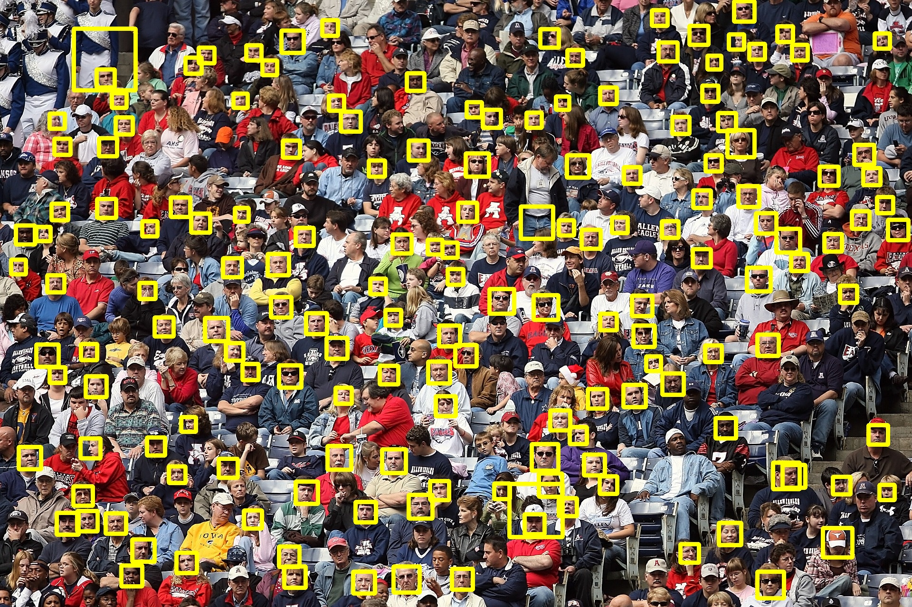
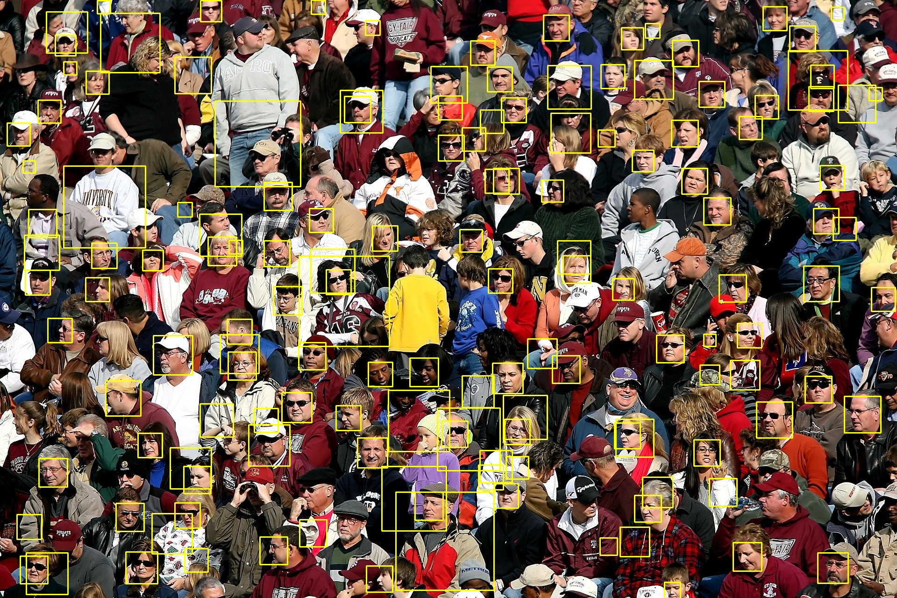
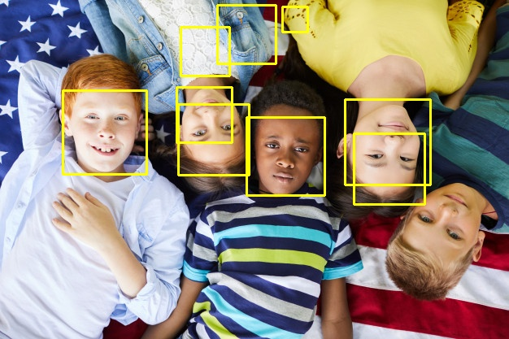

---
[//]: # (Title: Reconhecimento Facial em imagens com openCV)
[//]: # (Author:  Jonas Campos)
[//]: # (Date: April 1, 2011)
[//]: # (Comment: Explicações rápidas sobre o reconhecimento de imagens e a aplicação do openCV para reconhecer rostos em imagens) 
[//]: # (Tags: #opencv, #computervision, #python)  
---

## Reconhecimento Facial em imagens com openCV

O rosto humano, apesar das variações de pessoa para pessoa, possui uma composição básica que não se altera, lida pelos aplicativos como pontos em comum, que variam de acordo com a complexidade do sistema.

Ao utilizar algoritmos e um software que mapeiam esse padrão nas pessoas, é possível registrar apenas o rosto ou todos os movimentos e empregá-los nas mais diversas funções. Todas possuem o mesmo princípio: detectar um rosto em formas geométricas e logarítmicas e então montá-lo como em um quebra-cabeça. (Kleina, 2021)

Para reconhecer as imagens, usarei a Open Source Computer Vision Library (OpenCV), que é uma biblioteca com mais de 2500 algoritmos de visão computacional e aprendizado de máquina. Possui uma comunidade estimada em mais de 47 mil usuários colaboradores, e o download da biblioteca passa os 18 milhões (OpenCV, 2021).


```python
import cv2

from IPython.display import Image
```


```python
# para instalar a biblioteca OpenCV use o comando a seguir.
#!pip install opencv-contrib-python
Image(url='/data/img/face-recognition-2.jpg')
```


## Como são reconhecidos os rostos em imagens?

Para analisar estes arquivos, usarei a técnica do *haar-like cascades features*.
Segundo Antonello (2014) a tradução desta técnica seria algo como “características em cascata do tipo haar”. A palavra *haar* não possui tradução já que o nome deriva dos *wavelets Haar* (ondaleta ou onduleta de Haar) que foram usados no primeiro detector de rosto em tempo real.

*"A principal vantagem da técnica é a baixa necessidade de processamento para realizar a identificação dos objetos, o que se traduz em alta velocidade de detecção. "*\[p.49\]

Foi desenvolvido um método baseado nas onduletas de Haar, que considera as regiões retangulares adjacentes num local específico e então ocorre o processamento da intensidades dos pixels em cada região, calculando a diferença entre eles e categorizando subseções da imagem.

*Por exemplo, digamos que temos imagens com faces humanas. É uma característica comum que entre todas as faces a região dos olhos é mais escura do que a região das bochechas. Portanto, uma característica Haar comum para a detecção de face é um conjunto de dois retângulos adjacentes que ficam na região dos olhos e acima da região das bochechas. A posição desses retângulos é definida em relação a uma janela de detecção que age como uma caixa delimitadora para o objeto alvo (a face, neste caso).*\[p49-50\]


### Selecionado a imagem e transformado-a em uma matriz unidimencional (array)


```python
# carrega imagem e transforma em um array numpy
img = cv2.imread('data/img/torcida2.jpg')
# converte a imagem para tons de cinza( e transforma em um array numpy)
img_gray_tone = cv2.cvtColor(img, cv2.COLOR_BGR2GRAY)
```


```python
# carrega padrões de identificação de faces
default_faces_frontal = cv2.CascadeClassifier('data/haarcascade_profileface.xml')
```


```python
# executa a detecção de faces
faces = default_faces_frontal.detectMultiScale(img_gray_tone,
                                              scaleFactor = 1.05,
                                              minNeighbors = 7,
                                              minSize = (20, 20),
                                              flags = cv2.CASCADE_SCALE_IMAGE)
```


```python
# marca com retângulos as faces reconhecidas
for (x, y, weight, height) in faces:
    cv2.rectangle(img, (x, y), (x + weight, y + height), (0, 255, 255), 7)
```


```python
# exibe a imagem com uma contagem dos rostos reconhecidos

cv2.imshow(str(len(faces)) + 'rostos encontrados.', img)
cv2.waitKey(0)
```


```python
# salva imagem marcada

print(f'Foram encontrados {len(faces)} rostos')
cv2.imwrite('results/result_profileface.jpg', img)

# exibe a imagem nesta mesma janela
Image(url = 'results/result_profileface.jpg')
```

    Foram encontrados 108 rostos
    





#### Vamos criar uma função para reconhecer as imagens

Até aqui usamos os comandos isolados para melhor compreensão e explicação do tema. Vamos unir os passos anteriores em funções, para agilizar nossa vida.


```python
# função que mostra a imagem reconhecida marcada com quadrados amarelos
def imgShow(output):  
    from IPython.display import Image  
    Image(url = f'data/{output}')
```


```python
# função que recebe o caminho do arquivo e o nome do arquivo a ser salvo.
# o arquivo recebido é transformado em uma matriz, depois é analisado com
# base nos padrões de reconhecimento de rosto e retorna um arquivo marcado
# e conta a quantidade de rostos que reconheceu.

def imgFaceDetect(arquivo, nome_resultado):
    # carrega imagem e transforma em um array numpy
    img = cv2.imread(arquivo)
    # converte a imagem para tons de cinza( e transforma em um array numpy)
    img_gray_tone = cv2.cvtColor(img, cv2.COLOR_BGR2GRAY)

    # carrega padrões de identificação de faces
    default_faces_frontal = cv2.CascadeClassifier('data/haarcascade_profileface.xml')

    # executa a detecção de faces
    faces = default_faces_frontal.detectMultiScale(img_gray_tone, minNeighbors = 7, minSize = (20, 20), flags = cv2.CASCADE_SCALE_IMAGE)
    # marca com retângulos as faces reconhecidas
    for (x, y, weight, height) in faces:
        cv2.rectangle(img, (x, y), (x + weight, y + height), (0, 255, 255), 7)

    # salva imagem marcada
    print(f'Foram encontrados {len(faces)} rostos')
    cv2.imwrite(nome_resultado, img)
    # exibe imagem e contagem de faces
    
    imgShow(nome_resultado)
    

```


```python
imgFaceDetect('data/img/torcida1.jpg', 'results/torcida1.jpg')
```

    Foram encontrados 38 rostos
    


```python
imgShow('results/torcida1.jpg')
```


```python
### por algum motivo a exibição da imagem não está dando certo
# nem na função imgFaceDetect() e nem na imgShow()
# se alguém souber, por favor me avise o porquê. 
#xD
```


```python
# Vou mostrar as demais saídas usando nossa função e chamando o iPython para exibir o resultado
imgFaceDetect('data/img/torcida1.jpg', 'results/torcida1.jpg')

Image(url = 'results/torcida1.jpg')
```

    Foram encontrados 38 rostos
    





### Limitação na detecção

Vemos que nosso modelo de detectção não conseguiu reconhecer os rostos de todas as crianças.

Isso porque a a distância entre olhos, nariz e boca é diferente das de um adulto. 

Seria necessário construir um modelo específico para crianças para que tenhamos sucesso no reconhecimento de rostos.


```python
# Vou mostrar as demais saídas usando nossa função e chamando o iPython para exibir o resultado
imgFaceDetect('data/img/criancas1.jpg', 'results/criancas1.jpg')
from IPython.display import Image
Image(url = 'results/criancas1.jpg')
```

    Foram encontrados 1 rostos
    


```python
# Vou mostrar as demais saídas usando nossa função e chamando o iPython para exibir o resultado
imgFaceDetect('data/img/criancas3.jpg', 'results/criancas3.jpg')
Image(url = 'results/criancas3.jpg')
```

    Foram encontrados 0 rostos
    





```python
# Vou mostrar as demais saídas usando nossa função e chamando o iPython para exibir o resultado
imgFaceDetect('data/img/criancas2.jpg', 'results/criancas2.jpg')
Image(url = 'results/criancas2.jpg')
```

    Foram encontrados 1 rostos
    


## Referências

ANTONELLO, Ricardo. **Introdução a Visão Computacional com Python e OpenCV**. Engenharia de Controle e Automação do Instituto Federal Catarinense–IFC, campus Luzerna, 2014.

OpenCV.[**About**](https://opencv.org/about/). Acessado em 01/04/2021.

Kleinam, Nilton - [**Entenda como funcionam os sistemas de reconhecimento facial**](https://www.terra.com.br/noticias/tecnologia/hardware-e-software/entenda-como-funcionam-os-sistemas-de-reconhecimento-facial,da888a19d13ea310VgnCLD200000bbcceb0aRCRD.html). Acessado em 30/03/2021

---------------
**crédito das imagens** 

- Imagem de <a href="https://br.freepik.com/seventyfour">seventyfour</a>
in <a href="https://br.freepik.com/fotos-premium/criancas-americanas-inter-raciais_8773881.htm">FreePick</a>

- Imagem de <a href="https://pixabay.com/pt/users/383961-383961/?utm_source=link-attribution&amp;utm_medium=referral&amp;utm_campaign=image&amp;utm_content=428909">bigter choi</a> in <a href="https://pixabay.com/pt/photos/crian%C3%A7as-menina-menino-homem-%C3%ADndia-428909/">Pixabay</a>

- Imagem de <a href="https://pixabay.com/pt/users/keithjj-2328014/?utm_source=link-attribution&amp;utm_medium=referral&amp;utm_campaign=image&amp;utm_content=1488213">Keith Johnston</a>(
 <a href="https://pixabay.com/pt/photos/multid%C3%A3o-f%C3%A3s-de-esportes-1584115/">aqui</a> e <a href="https://pixabay.com/pt/photos/multid%C3%A3o-de-pessoas-multid%C3%A3o-1488213/"> aqui.)</a>

- Imagem de <a href="https://www.johnsnowlabs.com/the-math-behind-face-recognition/">Mohamed Tharwat</a> THE MATH BEHIND FACE RECOGNITION

- Imagem de <a href="https://pixabay.com/pt/users/ean254-4188723/?utm_source=link-attribution&utm_medium=referral&utm_campaign=image&utm_content=3137670">Ian Ingalula</a> in [pixabay](https://pixabay.com/pt/photos/pessoas-grupo-crian%C3%A7as-menino-3137670/)


## My social media profiles

<table>   
      <tr>
         <td><a href="https://www.linkedin.com/in/jonasaacampos/"></a></td>
         <td><a href="https://www.instagram.com/garotodeberlim/"></a>
   </td>
         <td><a href="https://www.facebook.com/jonasaacampos"></a></td>
          <td><a href="https://github.com/jonasaacampos"></a></td>
      </tr> 
</table>

